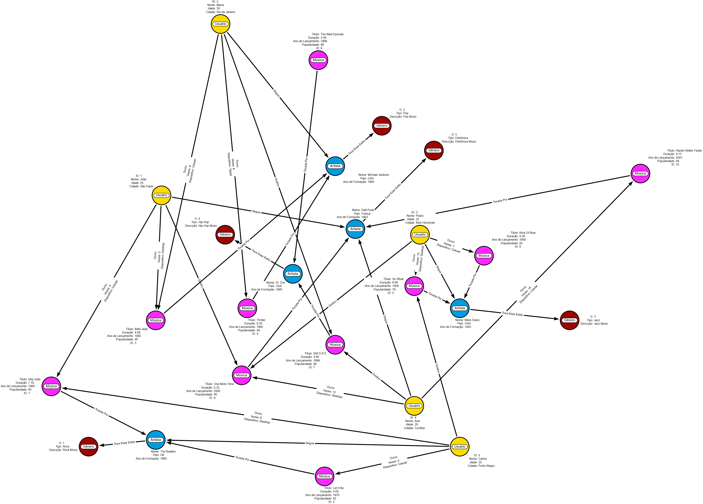

# 🎵 Algoritmo de Recomendação de Músicas com Neo4j

> Sistema de recomendação musical baseado em grafos, utilizando **Neo4j, Cypher e Graph Data Science** para explorar similaridade, comunidades, centralidade e conexões entre usuários e músicas.


---

## 📌 Sobre o Projeto

O **Algoritmo de Recomendação de Músicas** explora como bancos de dados orientados a grafos e algoritmos de **Graph Data Science (GDS)** podem ser utilizados na construção de sistemas de recomendação.

O projeto modela relacionamentos entre:

- usuários;
- músicas;
- artistas;
- gêneros;
- histórico e padrões de escuta.

A partir dessa rede, diferentes sinais são explorados para gerar recomendações, incluindo:

- **Jaccard Similarity** para similaridade;
- **Louvain** para detecção de comunidades;
- **PageRank** para análise de centralidade;
- **Shortest Paths** para conexões indiretas;
- combinação desses sinais em uma abordagem de **recomendação híbrida**.

O resultado é uma aplicação prática de **Graph Analytics + Recommendation Systems** em um domínio diretamente relacionado ao consumo musical.

---

## 🎯 Objetivo

O objetivo é demonstrar como relacionamentos presentes em dados de comportamento podem ser transformados em sinais para recomendação.

O projeto investiga questões como:

- Quais usuários possuem gostos musicais semelhantes?
- Quais comunidades surgem a partir dos padrões de relacionamento?
- Quais entidades possuem maior relevância estrutural na rede?
- Como conexões indiretas podem revelar novas músicas?
- Como combinar diferentes sinais do grafo para gerar recomendações?

---

## 🧠 Por que Grafos para Recomendação?

Sistemas de recomendação trabalham fundamentalmente com **relacionamentos**.

Em um cenário musical:

```text
Usuário
   │
   └── OUVIU ──> Música
                   │
                   ├── INTERPRETADA_POR ──> Artista
                   │
                   └── PERTENCE_A ────────> Gênero
```

Ao mesmo tempo, usuários diferentes podem compartilhar músicas, artistas e gêneros:

```text
Usuário A ── OUVIU ──> Música X <── OUVIU ── Usuário B
```

Essas conexões criam sinais de afinidade.

Em vez de analisar cada tabela isoladamente, o modelo em grafo permite percorrer diretamente os relacionamentos e investigar padrões de proximidade, similaridade, influência e comunidade.

---

## 🏗️ Arquitetura Conceitual

```text
Usuários + Músicas + Artistas + Gêneros
                  │
                  ▼
            Grafo Neo4j
                  │
                  ▼
       Consultas e Graph Analytics
                  │
       ┌──────────┼──────────┐
       │          │          │
       ▼          ▼          ▼
   Jaccard     Louvain    PageRank
       │          │          │
       └──────────┼──────────┘
                  │
           Shortest Paths
                  │
                  ▼
         Geração de Candidatos
                  │
                  ▼
       Recomendação Híbrida
                  │
                  ▼
          Ranking de Músicas
```

---

## 🕸️ Visualização do Grafo

<p align="center">
  
</p>

A visualização representa as conexões utilizadas para explorar padrões de consumo musical e gerar candidatos para recomendação.

---

# 🔬 Estratégias e Algoritmos

## 1. 🔎 Queries Básicas de Recomendação

As primeiras consultas exploram relações diretas do grafo para encontrar músicas e entidades relacionadas às preferências de um usuário.

Arquivo:

[`Queries/02-queries-basicas.cypher`](Queries/02-queries-basicas.cypher)

Essa etapa estabelece uma baseline conceitual antes da aplicação dos algoritmos de Graph Data Science.

---

## 2. 👥 Jaccard Similarity

A **Similaridade de Jaccard** permite comparar conjuntos de elementos compartilhados entre usuários.

Conceitualmente:

```text
Usuário A → músicas ouvidas
             ∩
Usuário B → músicas ouvidas
             ↓
        Similaridade
```

Usuários que compartilham maior quantidade de preferências podem fornecer sinais relevantes para recomendação colaborativa.

Arquivo:

[`Queries/03-jaccard-similarity.cypher`](Queries/03-jaccard-similarity.cypher)

### Aplicações

- identificação de usuários semelhantes;
- collaborative recommendation;
- descoberta de afinidades;
- geração de candidatos.

---

## 3. 🧩 Louvain Community Detection

O algoritmo **Louvain** é utilizado para identificar comunidades na estrutura do grafo.

Essas comunidades podem representar grupos de usuários ou entidades conectados por padrões semelhantes.

Arquivo:

[`Queries/04-louvain.cypher`](Queries/04-louvain.cypher)

### Aplicações

- segmentação comportamental;
- descoberta de grupos;
- identificação de nichos musicais;
- recomendação baseada em comunidade.

---

## 4. ⭐ PageRank

O **PageRank** mede a importância estrutural dos nós considerando não apenas a quantidade de conexões, mas também a relevância das entidades conectadas.

Arquivo:

[`Queries/05-pagerank.cypher`](Queries/05-pagerank.cypher)

### Aplicações

- identificação de entidades relevantes;
- ranking;
- popularidade estrutural;
- priorização de candidatos.

---

## 5. 🛣️ Shortest Paths

A análise de **caminhos mais curtos** permite explorar conexões indiretas entre elementos do grafo.

Arquivo:

[`Queries/06-shortest-paths.cypher`](Queries/06-shortest-paths.cypher)

Uma recomendação pode surgir, por exemplo, de uma sequência de afinidades:

```text
Usuário
   ↓
Música conhecida
   ↓
Artista
   ↓
Gênero
   ↓
Outra música
```

### Aplicações

- descoberta de conteúdo;
- explicabilidade;
- relações indiretas;
- exploração de catálogo.

---

# 🎯 Sistema de Recomendação Híbrido

O estágio final combina diferentes sinais encontrados no grafo.

```text
Preferências do Usuário
          +
Similaridade entre Usuários
          +
Comunidades
          +
Centralidade
          +
Conexões Indiretas
          ↓
   Combinação dos Sinais
          ↓
    Ranking de Candidatos
          ↓
       Recomendação
```

Arquivo:

[`Queries/07-recomendacao-hibrida.cypher`](Queries/07-recomendacao-hibrida.cypher)

A abordagem híbrida é particularmente interessante porque evita depender de um único critério.

Uma música pode se tornar uma boa candidata porque:

- usuários semelhantes a escutaram;
- pertence a uma comunidade relacionada;
- possui relevância estrutural;
- está conectada indiretamente às preferências existentes.

---

## 🔄 Pipeline Analítico

```text
Dados de Exemplo
      ↓
Schema do Grafo
      ↓
Nós + Relacionamentos
      ↓
Neo4j
      ↓
Cypher
      ↓
Graph Data Science
      ↓
┌───────────────────────┐
│ Similaridade          │
│ Comunidades           │
│ Centralidade          │
│ Caminhos              │
└───────────┬───────────┘
            ↓
   Geração de Candidatos
            ↓
   Recomendação Híbrida
            ↓
          Ranking
            ↓
          Músicas
```

---

## 🗃️ Schema e Dados de Exemplo

O grafo utilizado nas análises pode ser criado a partir do arquivo:

[`Queries/01-schema-dados-exemplo.cypher`](Queries/01-schema-dados-exemplo.cypher)

Ele fornece a estrutura necessária para executar as consultas e algoritmos apresentados no projeto.

O repositório também preserva o artefato JSON relacionado ao desenvolvimento:

[`Data/algoritmo-recomendacao-musicas.json`](Data/algoritmo-recomendacao-musicas.json)

---

## 🛠️ Tecnologias

| Tecnologia | Aplicação |
|---|---|
| **Neo4j** | Banco de dados orientado a grafos |
| **Cypher** | Modelagem e consultas |
| **Neo4j GDS** | Graph Data Science |
| **Jaccard Similarity** | Similaridade entre usuários |
| **Louvain** | Detecção de comunidades |
| **PageRank** | Centralidade e relevância estrutural |
| **Shortest Paths** | Análise de conexões indiretas |
| **Git** | Versionamento |
| **GitHub** | Repositório e documentação |

---

## 📂 Estrutura do Repositório

```text
Algoritmo-Que-Recomenda-Musicas/
│
├── Assets/
│   └── grafo-recomendacao-musical.png
│
├── Data/
│   └── algoritmo-recomendacao-musicas.json
│
├── Queries/
│   ├── 01-schema-dados-exemplo.cypher
│   ├── 02-queries-basicas.cypher
│   ├── 03-jaccard-similarity.cypher
│   ├── 04-louvain.cypher
│   ├── 05-pagerank.cypher
│   ├── 06-shortest-paths.cypher
│   └── 07-recomendacao-hibrida.cypher
│
└── README.md
```

A separação entre `Assets`, `Data` e `Queries` mantém os artefatos organizados de acordo com sua finalidade.

---

# ▶️ Como Executar

## Pré-requisitos

- Neo4j
- Neo4j Graph Data Science Library
- ambiente capaz de executar consultas Cypher

### 1. Clone o projeto

```bash
git clone https://github.com/MCLG1661/Algoritmo-Que-Recomenda-Musicas.git
cd Algoritmo-Que-Recomenda-Musicas
```

### 2. Crie o grafo

Execute:

```text
Queries/01-schema-dados-exemplo.cypher
```

### 3. Explore as consultas básicas

Execute:

```text
Queries/02-queries-basicas.cypher
```

### 4. Explore os algoritmos

Execute individualmente:

```text
Queries/03-jaccard-similarity.cypher
Queries/04-louvain.cypher
Queries/05-pagerank.cypher
Queries/06-shortest-paths.cypher
```

### 5. Execute a abordagem híbrida

Por fim:

```text
Queries/07-recomendacao-hibrida.cypher
```

---

## 💼 Aplicações de Negócio

Embora o domínio utilizado seja música, os conceitos demonstrados podem ser aplicados a diversos cenários.

### Streaming e entretenimento

- recomendação musical;
- descoberta de artistas;
- criação de playlists;
- personalização de catálogo.

### E-commerce

```text
Cliente → Produto → Categoria → Cliente semelhante
```

### Marketing

```text
Consumidor → Conteúdo → Interesse → Segmento
```

### Social Media

```text
Usuário → Creator → Tema → Comunidade
```

### CRM

```text
Cliente → Produto → Comportamento → Próxima melhor oferta
```

O ponto central é utilizar **relações entre entidades como fonte de inteligência para recomendação e personalização**.

---

## 💡 Competências Demonstradas

### Graph Data

- Neo4j
- Cypher
- Graph Databases
- Graph Data Modeling
- Graph Data Science
- Network Analysis

### Algoritmos

- Jaccard Similarity
- Louvain
- PageRank
- Shortest Paths
- Community Detection
- Centrality Analysis
- Similarity Analysis

### Recommendation Systems

- geração de candidatos;
- similaridade entre usuários;
- recomendação baseada em comunidade;
- ranking;
- recomendação híbrida;
- exploração de conexões indiretas.

### Engenharia

- NoSQL;
- organização de queries;
- Git;
- GitHub;
- documentação técnica.

---

## 🚀 Possíveis Evoluções

O projeto pode evoluir em diferentes direções.

### Dados

- dataset musical de maior escala;
- histórico real de interação;
- quantidade de reproduções;
- likes e skips;
- playlists;
- contexto temporal.

### Graph Data Science

- Node Similarity;
- K-Nearest Neighbors;
- FastRP;
- Node Embeddings;
- Link Prediction;
- Graph Machine Learning.

### Recommendation Systems

- Collaborative Filtering;
- Content-Based Filtering;
- comparação entre métodos;
- personalização em tempo real.

### Avaliação

Implementação de métricas como:

- Precision@K;
- Recall@K;
- NDCG;
- Hit Rate;
- Coverage.

### Produto

Uma evolução natural seria transformar o projeto em uma aplicação completa:

```text
Neo4j
   ↓
Recommendation Engine
   ↓
API
   ↓
FastAPI
   ↓
Interface
   ↓
Streamlit / Web App
```

---

## ⚠️ Limitações

O projeto possui finalidade **educacional e demonstrativa**.

O grafo utiliza dados de exemplo para explorar técnicas de Graph Data Science e sistemas de recomendação.

Consequentemente:

- os resultados não representam recomendações de uma plataforma musical em produção;
- não existe avaliação offline ou online das recomendações;
- o volume de dados é limitado;
- o projeto demonstra conceitos e arquitetura, não um recommendation engine em escala comercial.

Essas limitações também indicam caminhos claros para evolução futura.

---

## 🎓 Contexto Acadêmico

Projeto desenvolvido como desafio da disciplina **Primeiros Passos com Cypher e Neo4j**, integrante do **Bootcamp Neo4j — Análise de Dados com Grafos**, da DIO.

**Professor:** Matheus Ferreira  
**Período:** Primeiro semestre de 2026  
**Entrega:** 12/03/2026

---

## 👨‍💻 Autor

**Marcus Guedes**

Marketing | Data Science | Inteligência Artificial | Gestão de Projetos

- **GitHub:** [MCLG1661](https://github.com/MCLG1661)
- **LinkedIn:** [Marcus Guedes](SEU-LINK-DO-LINKEDIN)

---

⭐ Se este projeto foi útil como referência para Graph Analytics ou Recommendation Systems, considere deixar uma estrela no repositório.

🎵 **Transformando conexões entre usuários e músicas em recomendações.**
